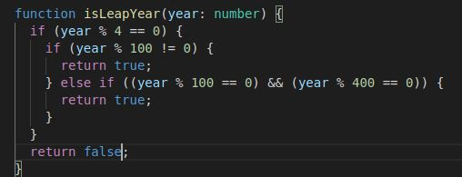
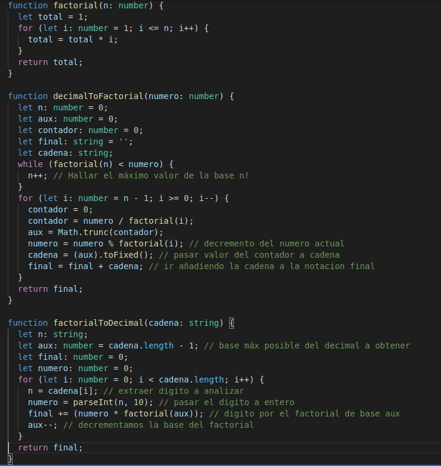
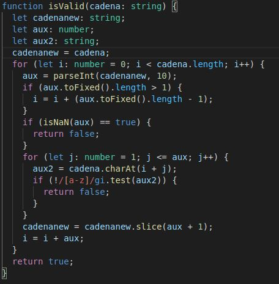
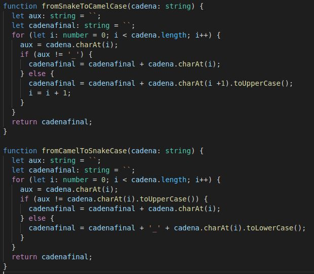
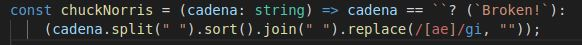
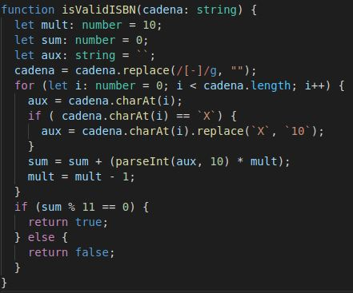
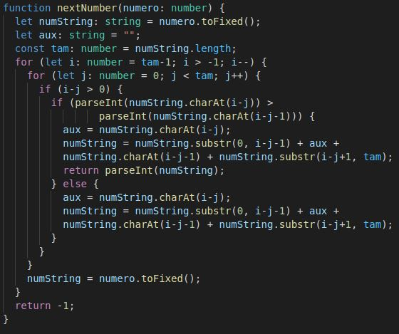
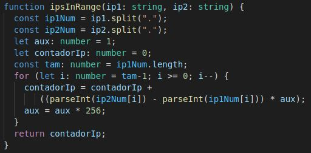
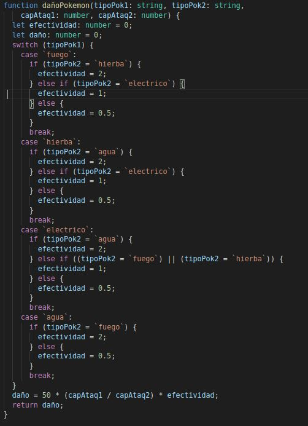
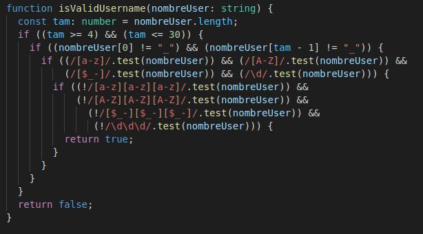

# INFORME PRACTICA 3
## Tipos de datos estáticos y funciones
### ALBERTO RIOS DE LA ROSA
### alu0101235929@ull.edu.es

### INTRODUCCIÓN

Esta práctica tiene como función principal empezar a realizar ejercicios de programación para empezar a realizar codigo en TypeScript, principalemte en los disintos tipos de datos estáticos como las funciones. Primero de todo estableceremos la creacion de nuestro proyecto para trabajar con TypeScript en el siguiente [enlace](https://ull-esit-inf-dsi-2021.github.io/typescript-theory/typescript-project-setup.html) A continuación mostraremos la solución a cada uno de los diez ejercicios propuestos con una breve explicación de cada uno y una captura de pantalla con un ejemplo de salida del ejercicio. Si desea leer los enunciados de cada ejercicio los podrás encontrar pinchando [aqui](https://ull-esit-inf-dsi-2021.github.io/prct03-types-functions/).

### ELABORACIÓN DE LOS EJERCICIOS

### Ejercicio-1. Años bisiestos

***Código resuelto*** = [Solución](https://github.com/ULL-ESIT-INF-DSI-2021/ull-esit-inf-dsi-20-21-prct03-static-types-functions-Espinette/blob/master/src/ejercicio-1.ts)

***Resumen enunciado*** 

Crear una funcion `isLeapYear` que devuelva true o false en el caso de que sea o no bisiesto el año. Para que una año sea bisiesto debe cumplir las siguientes condiciones:

  - Cada año que es divisible por 4.
  - Excepto cada año que es divisible por 100.
  - Al menos que el año también sea divisible por 400.
 
***Captura y explicación de la función resuelta***
 
  

Para lograr el objetivo de la funcion, que recibe como parametro el año a analizar y como salida si es true o false en funcion de si es bisiesto. Creamos una condicion `if` para ver si el año es divisible por 4, de no ser así nos retorna false, en el caso de que sea divisible tambien debemos comprobar las otras dos condiciones, la primera es que no sea divible por 100 y la otra es que si es divisible por 100 lo sea por 400 tambien, en ambos casos retornando true, si no es cierta ninguna condicion devuelve que es falso y por lo tanto no es bisiesto.

### Ejercicio-2. Notación decimal y factorial

***Código resuelto*** = [Solución](https://github.com/ULL-ESIT-INF-DSI-2021/ull-esit-inf-dsi-20-21-prct03-static-types-functions-Espinette/blob/master/src/ejercicio-2.ts)

***Resumen enunciado*** 

Crear dos funciones, `decimalToFactorial` y `factorialToDecimal`. La primera recibirá un numero entero y devolverá una cadena de texto con la representación factorial del número y la segunda función hará justo lo contrario, recibirá una cadena de texto en notación factorial y devolverá el número entero que representa. Un ejemplo de representación sería:

El número 463 codificado en notación factorial sería 341010 ya que:
  - 463 = 3 x 5! + 4 x 4! + 1 x 3! + 0 x 2! + 1 x 1! + 0 x 0!

***Captura y explicación de la función resuelta***

  

Para llevar a cabo ambas funciones primero realizamos una funcion `factorial` que recibirá como parámetro un número y retornará la solución del factorial del mismo número. Está funcion la usaremos en repetidas ocasiones en ambas funciones.

En la función `decimalToFactorial` se le pasa un número entero para factorizarla. Lo que haremos paso a paso será lo siguiente:

  1. Inicializamos un numero n a 0 
  2. Bucle while en el que tiene como condición que el factorial de n sea menor que el número que recibe y por cada iteración se incrementará n en una unidad para hallar el valor máximo que obtendrá el numeró al factorizarlo.
  3. Bucle for que vaya desde n hasta 0, en el que por cada iteración se calculará el numero de veces por el que se factoriza dicho número dividiendo el numero entre el factorial, el valor actual del nuevo número a partir del resto de la divison, y con la parte entera del resultado de la división lo convertiremos en cadena y se lo agregamos a la cadena final
  4. Return de la cadena final.

En la función `factorialToDecimal` se le pasa una cadena de texto en notacaión factorial para obtener el número que pertenece. Lo que haremos paso a paso será lo siguiente:

  1. Inicializamos un valor aux al (tamaño de la cadena -1) ya que será la base máxima del decimal a obtener
  2. Bucle for desde la primera posición de la cadena hasta la última posición de este. En el que obtenemos el dígito a analizar, lo pasamos de string a number a traves de la **función `parseInt`** luego obtenemos el resultado del número por el factorial de aux, y lo sumamos al valor final, y decrementamos el valor de aux.
  3. Return del resultado final

### Ejercicio-3. Validador de mensajes

***Código resuelto*** = [Solución](https://github.com/ULL-ESIT-INF-DSI-2021/ull-esit-inf-dsi-20-21-prct03-static-types-functions-Espinette/blob/master/src/ejercicio-3.ts)

***Resumen enunciado*** 

Crear una funcion isValid que recibira una cadena formada por numeors y letras y devuelva true si por cada numero que se encuentre tenga esa cantidad de letras de forma consecutiva y devuelve false en caso de no cumplirse. Un ejemplo de cadena válida sería:

  - `3hey5hello2hi` se debería dividir en `3, hey, 5, hello, 2, hi`.
 
***Captura y explicación de la función resuelta***

  

El objetivo de esta función es comprobar si un mensaje es válido. Para ello creamos un bucle for que recorre la cadena entera, primero comprueba si la posicion en la que se encuentra es un número si no es así retorna falso. Luego avanzamos en la cadena hasta la primera letra y lo que hacemos es un bucle for dentro del anterior que vaya desde 0 hasta el número encontrado, que lo que hace es ir posición a posición para comprobar que haya tanta letras como el numero que indicaba previamente. Si todo esto se cumple retorna true, en caso de no ser así retorna false, al ser un mensaje no válido.

### Ejercicio-4. Conversor de estilo

***Código resuelto*** = [Solución](https://github.com/ULL-ESIT-INF-DSI-2021/ull-esit-inf-dsi-20-21-prct03-static-types-functions-Espinette/blob/master/src/ejercicio-4.ts)

***Resumen enunciado*** 

Desarrollar dos funciones `fromSnakeToCamelCase` y `fromCamelToSnakeCase` cuyo objetivo será recibir una cadena de texto y deberá convertir esa cadena al formato contrario. Ambos formatos son los siguientes:

  - *Snake case* = `sample_string` y `the_stealth_warrior`
  - *Camel case* = `sampleString` y `theStealthWarrior`
 
***Captura y explicación de la función resuelta***

  

En la funcion `fromSnakeToCamelCase` tendremos un bucle for que irá posición a posición de la cadena y lo que hará es guardarla en una cadena nueva, con la condición de que si encuentra una `_` covertirá el siguiente elemento de la cadena en mayúscula con la **función `toUpperCase()`** introduciendola en la nueva cadena, además de incrementar la posicion en uno para saltarnos la letra ya analizada, retornando la cadena en formato *Camel Case*

Por otro lado en la funcion `fromCamelToSnakeCase` tendrá tambien un bucle for que irá posición a posición de la cadena y lo que hará es guardarla en una cadena nueva, pero esta vez con la condición de que si encuentra una letra mayúscula lo que añadirá a una cadena es una `_` y el carácter en mayúscula convertido en minúscula con la **función `toLowerCase()`**,  retornando la cadena en formato *Snake Case*

### Ejercicio-5. Un solo golpe

***Código resuelto*** = [Solución](https://github.com/ULL-ESIT-INF-DSI-2021/ull-esit-inf-dsi-20-21-prct03-static-types-functions-Espinette/blob/master/src/ejercicio-5.ts)

***Resumen enunciado*** 

Crear una función que combine 4 métodos en una línea. Esta recibira una cadena, está cadena debe sapararse por palabras, ordenarlas, unirla de nuevo nuevamente y eliminar todas las letras ´a´ y ´e´, mostrando la cadena resultante, en caso de recibir la cadena vacía debreá devolver el mensaje `Broken!`. Algun ejemplo esperado son los siguientes:

  - onePunch(‘Beard Jeans Hairbrush Knuckleduster Sand’) => `Brd Hirbrush Jns Knuckldustr Snd`
  - onePunch(‘Sock Beard Vest Lady Sage’) =>`Brd Ldy Sg Sock Vst`
  - onePunch(‘Beard Sack Gun Parachute Face-Kicking-Shoes’) => `Brd Fc-Kicking-Shos Gun Prchut Sck`
  - onePunch(‘Snot Snow Soda Tank Beard’) => `Brd Snot Snow Sod Tnk`
  - onePunch(‘’) =>`Broken!`
  
***Captura y explicación de la función resuelta***

  

Es una función anónima que tiene dos opciones, la primera es que si la cadena está vacía retorna `Broken!` y en caso de no ser así primero separa la cadena por espacios con la **función `split(" ")`**, las ordenará por orden alfabético con la **función `sort()`**, las volverá a unir con la **función `join(" ")`**, y finalmente eliminará todos los carácteres `a` y `e` de la cadena a través de la **función `replace(/[ae]/gi, "")`** retornando el resultado final.

### Ejercicio-6. Conversor ISBN

***Código resuelto*** = [Solución](https://github.com/ULL-ESIT-INF-DSI-2021/ull-esit-inf-dsi-20-21-prct03-static-types-functions-Espinette/blob/master/src/ejercicio-6.ts)

***Resumen enunciado*** 

Crear una función `isValidISBN` que comprobará la validez de un código ISBN-10. Esta función recibirá como parámetro una cadena de un posible código ISBN-10 separada o no por guiones. Estará compuesto por 9 digitos numéricos y un caracter de comprobación que podrá ser un numero del 0-9 o una X (En este caso la X tendrá valor 10). Para comprobar la validez se hará a partir de la siguiente fórmula:

`(x1 * 10 + x2 * 9 + x3 * 8 + x4 * 7 + x5 * 6 + x6 * 5 + x7 * 4 + x8 * 3 + x9 * 2 + x10 * 1) mod 11 == 0`

La funcion retornará true o false en funcion de si es válido o no. Dos ejemplos de ISBN válidos son:

  - `3-598-21508-8` o `3598215088`
  - `3-598-21507-X` o `359821507X`
  
***Captura y explicación de la función resuelta***

  

### Ejercicio-7. El siguiente número

***Código resuelto*** = [Solución](https://github.com/ULL-ESIT-INF-DSI-2021/ull-esit-inf-dsi-20-21-prct03-static-types-functions-Espinette/blob/master/src/ejercicio-7.ts)

***Resumen enunciado*** 

Crear una funcion que reciba un número entero y deberá devolver el siguiente número mayor formado por los mismos dígitos que el número encontrado. En caso de no encontrar un número mayor devolverá un -1. Algunos ejemplos son: 

  - 12 –> 21
  - 513 –> 531
  - 2017 –> 2071
  - 9 -> -1
  - 111 -> -1
  - 531 -> -1
  
***Captura y explicación de la función resuelta***

  

Esta funcion tiene como objetivo obtener el siguiente número a partir de los mismos dígitos del numero introducido. Tendremos dos bucles for uno desde el inicio hasta el final del número y otro al revés desde el final al principio y lo que haremos es desplazar el último número a la izquierda hasta que encuentre uno menor que intercambiará y retornará el número, siendo el siguiente posible. De no encontrar ningun número final lo que hará es lo mismo pero analizando el penultimo numero con el resto y así sucesivamente. Si nunca encuentra un numero mayor posible lo que hará será reotnar -1.

### Ejercicio-8. Contando IPs

***Código resuelto*** = [Solución](https://github.com/ULL-ESIT-INF-DSI-2021/ull-esit-inf-dsi-20-21-prct03-static-types-functions-Espinette/blob/master/src/ejercicio-8.ts)

***Resumen enunciado*** 

Crear una función que reciba como parámetro una cadena de texto que representa una direccion IPv4, esta deberá devolver el valor número de las IPs disponibles en ese rango(Incluyendo la primera pero no la última). Algunos ejemplos para esta función son:

  - `ipsInRange(“10.0.0.0”, “10.0.0.50”) == 50`
  - `ipsInRange(“10.0.0.0”, “10.0.1.0”) == 256`
  - `ipsInRange(“20.0.0.10”, “20.0.1.0”) == 246`

***Captura y explicación de la función resuelta***

  

Esta función recibirá dos Ips, lo que haremos será calcular las Ips disponibles dentro de este rango. Primero de todo sepraremos con la **función `split(".")`** cada una de las ip en un array de string, además de crear un aux e inicializarlo a 1. Luego creamos un bucle for que lo que hará será recorrer desde la ultima posicion del array hasta la primera, lo que haremos será obtener en cifra numérica dicho valor y lo restaremos ip2 - ip1 ese resultado se lo multiplicamos al aux, que será 1 en la primera iteracion pero se irá multiplicando por 256 cada vez que avance en el bucle. Y retornará la suma total del final del bucle. 

### Ejercicio-9. Entrenador Pokemon

***Código resuelto*** = [Solución](https://github.com/ULL-ESIT-INF-DSI-2021/ull-esit-inf-dsi-20-21-prct03-static-types-functions-Espinette/blob/master/src/ejercicio-9.ts)

***Resumen enunciado*** 

Desarrollar una función que reciba como parámetro el tipo de Pokemon que tiene, el tipo de Pokemon del atacante, la capacidad de ataque del primero y la de defensa del segundo. La función deovlverá el daño causado que se obtiene a partir de la siguiente fórmula:

`daño = 50 * (ataque / defensa) * efectividad`

La efectividad será 2, 1 o 0.5 en función de cada emparejamiento:

  - fuego > hierba
  - fuego < agua
  - fuego = eléctrico
  - agua < hierba
  - agua < eléctrico
  - hierba = eléctrico

Aquellos que son del mismo tipo tendrán efectividad 0.5

***Captura y explicación de la función resuelta***

  

La función recibirá los dos tipos de pokemon y la capacidad de ataque de uno y de defensa del otro. Esta función resulta bastante sencilla, y el objetivo principal será obtener el valor de la efectividad, lo que haremos será crear un `switch` que recibirirá el tipo del pokemon 1, en función del tipo que sea entrará a dicho caso. Dentro de ese caso encontraremos unas conidicones `if else` que en funcion del tipo del pokemon 2 establecerá un valor a la variable efectividad y saldremos del switch. Por ultimo se calcurará el daño y retornaremos el resultado de este.

### Ejercicio-10. Validador de nombre usuario

***Código resuelto*** = [Solución](https://github.com/ULL-ESIT-INF-DSI-2021/ull-esit-inf-dsi-20-21-prct03-static-types-functions-Espinette/blob/master/src/ejercicio-10.ts)

***Resumen enunciado*** 

Crear una función `isValidUsername` que deberá comprobar la validez de un nombre de usuario, esta recibirá una cadena con el nombre de usuario y retornará true o false en función de si cumple o no las siguientes condiciones:

  - El nombre de usuario tiene que tener al menos 4 caracteres y no más de 30.
  - El nombre de usuario no puede empezar ni terminar con un guión bajo.
  - El nombre de usuario tiene que contener al menos una letra mayúscula, una letra minúscula, un número y algún símbolo especial ($,-,_).
  - No se permite la repetición de un mismo tipo de caracter más de dos veces seguidas.

***Captura y explicación de la función resuelta***

  

La funcion `isValidUsername` recibirá un nombre de usuario, lo que hemos hecho ha sido crear unos conicionantes `if` en el que dentro de estes se establescan las condiciones pedidas en el enunciado, usando test de expresiones regulares para hacer más sencillo el código. Si se cumple todas las condiciones retornará true al ser el usuario válido y false si no lo es.
